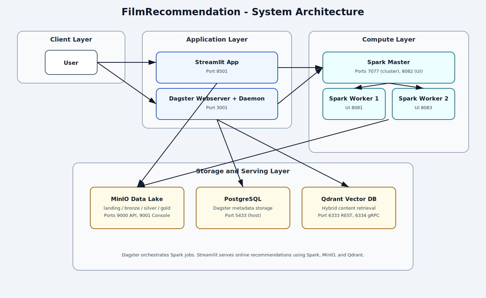
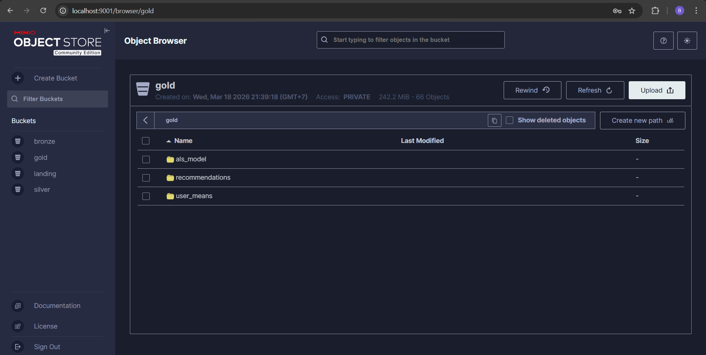
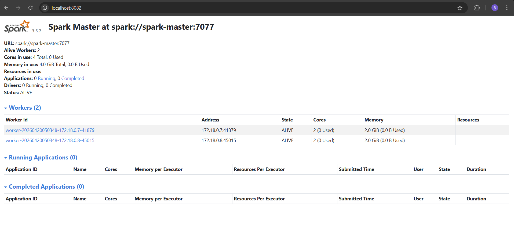
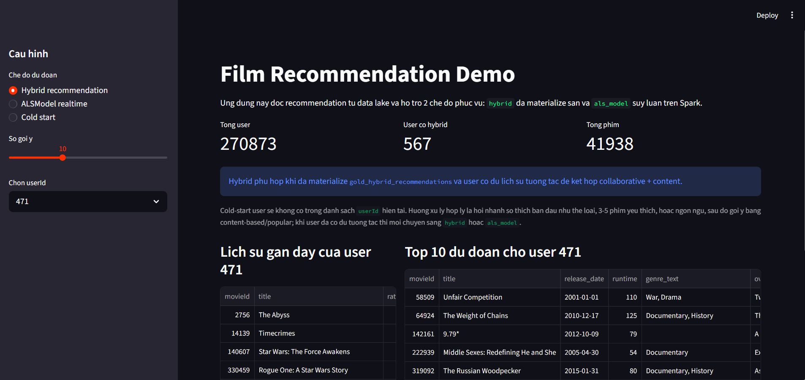
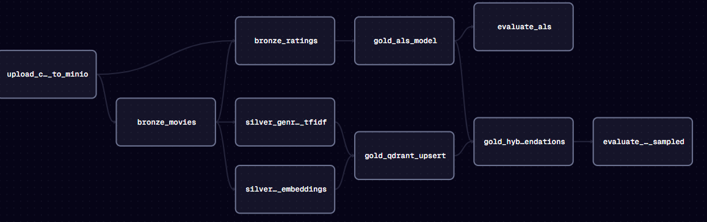

# FilmRecommendation

Distributed movie recommendation system powered by Spark, Dagster, MinIO, and Qdrant, with a Streamlit UI for online demo and exploration.

## Overview

This project implements a hybrid recommender pipeline with two core signals:

- Collaborative filtering using ALS (PySpark MLlib).
- Content-based retrieval using TF-IDF (genres) and SentenceTransformer embeddings (movie overview) on Qdrant.

Final recommendations are blended into a hybrid score and stored in the Gold layer of the MinIO data lake.

## Architecture Diagram



The architecture image is available at `docs/images/architecture.svg`.

## Service Screenshots

### MinIO



The MinIO screenshot is available at `docs/images/minio.png`.

### Spark



The Spark screenshot is available at `docs/images/spark.png`.

### Streamlit



The Streamlit screenshot is available at `docs/images/streamlit.png`.

## Spark Pipeline Flow



The flow image is available at `docs/images/spark-flow.png`.

## Pipeline Layers and Assets

### Ingest

- `upload_csv_to_minio`
  - Uploads local CSV files (`ratings.csv`, `movies_metadata.csv`, `links.csv`) into the `landing` bucket.

### Bronze

- `bronze_movies`
  - Reads raw movie metadata as strings.
  - Cleans malformed rows.
  - Parses genres into `genre_list`.
  - Filters invalid runtime and missing overview/title fields.
  - Writes to `s3a://bronze/movies/`.
- `bronze_ratings`
  - Normalizes rating schema and data types.
  - Maps MovieLens `movieId` to TMDB IDs via `links.csv`.
  - Removes invalid and duplicate interactions.
  - Keeps only movies that exist in Bronze movies.
  - Writes to `s3a://bronze/ratings/`.

### Silver

- `silver_genres_tfidf`
  - Builds TF-IDF vectors from movie genres.
- `silver_synopsis_embeddings`
  - Builds 384-dimensional embeddings from movie overview text with `all-MiniLM-L6-v2`.

### Gold

- `gold_als_model`
  - Performs chronological split for train/test.
  - Trains ALS on user-mean normalized ratings.
  - Saves ALS model and user means.
- `gold_qdrant_upsert`
  - Joins movie metadata with Silver vectors.
  - Recreates and upserts Qdrant collection in batches.
- `gold_hybrid_recommendations`
  - Generates collaborative candidates from ALS.
  - Generates content candidates from Qdrant similarity.
  - Normalizes and blends scores into `hybrid_score`.
  - Writes hybrid output to Gold layer.

### Evaluate

- `evaluate_als`
  - Computes ALS quality metrics such as RMSE, MAE, and prediction coverage.
- `evaluate_hybrid_sampled`
  - Computes sampled retrieval metrics such as Hit@K and NDCG@K.

## Tech Stack

- Orchestration: Dagster
- Processing: PySpark 3.5.7
- Data lake: MinIO (S3-compatible via S3A)
- Vector database: Qdrant
- UI: Streamlit
- Metadata database: PostgreSQL
- Runtime: Docker Compose

## Requirements

- Docker and Docker Compose plugin
- Recommended memory: 8-12GB RAM for stable Spark + embedding workloads
- Linux/macOS (Windows via WSL2 is also viable)

## Quick Start

### 1) Create environment file

Create `.env` (note: current `.env.example` is empty) with values similar to:

```bash
POSTGRES_USER=postgres
POSTGRES_PASSWORD=postgres
POSTGRES_DB=filmrec
POSTGRES_HOST=postgres
POSTGRES_PORT=5432
CONTAINER_POSTGRES_PORT=5432

DATABASE_URL=postgresql://${POSTGRES_USER}:${POSTGRES_PASSWORD}@${POSTGRES_HOST}:${CONTAINER_POSTGRES_PORT}/${POSTGRES_DB}

DAGSTER_ENV=dev
DAGSTER_HOME=/opt/dagster/dagster_home/dagster-project

MINIO_ROOT_USER=admin
MINIO_ROOT_PASSWORD=admin123
AWS_DEFAULT_REGION=us-east-1
AWS_S3_ENDPOINT=http://minio:9000

METABASE_DB=metabase
HIVE_DB=hive

QDRANT_URL=http://qdrant:6333
```

### 2) Download Spark dependency JARs

```bash
bash jars/downloads.sh
```

Expected files:

- `hadoop-aws-3.3.4.jar`
- `aws-java-sdk-bundle-1.12.262.jar`
- `postgresql-42.7.8.jar`

### 3) Build and start all services

```bash
docker compose up -d --build
```

### 4) Open service endpoints

- Streamlit: http://localhost:8501
- Dagster UI: http://localhost:3001
- MinIO Console: http://localhost:9001
- Spark Master UI: http://localhost:8082
- Spark Worker 1 UI: http://localhost:8081
- Spark Worker 2 UI: http://localhost:8083
- Qdrant API: http://localhost:6333
- PostgreSQL host port: `5433`

## Running the Dagster Pipeline

In Dagster UI, materialize assets in this order:

1. `upload_csv_to_minio`
2. Bronze: `bronze_movies`, `bronze_ratings`
3. Silver: `silver_genres_tfidf`, `silver_synopsis_embeddings`
4. Gold: `gold_als_model`, `gold_qdrant_upsert`, `gold_hybrid_recommendations`
5. Evaluate: `evaluate_als`, `evaluate_hybrid_sampled`

The Streamlit app supports three serving modes:

- Hybrid recommendation
- ALS realtime
- Cold-start recommendation

## Data Layout

- `data/dataset`: raw CSV input
- `data/minio/landing`: ingested raw files
- `data/minio/bronze`: cleaned base data
- `data/minio/silver`: feature vectors
- `data/minio/gold`: trained artifacts and final recommendations

## Common Issues

- Spark cannot access MinIO:
  - Verify `AWS_S3_ENDPOINT`, access key, and secret key in `.env`.
  - Verify JAR files exist in `jars/`.
- Dagster run fails due to metadata DB:
  - Verify `POSTGRES_*`, `DATABASE_URL`, and Postgres health status.
- No hybrid results in Streamlit:
  - Ensure `gold_hybrid_recommendations` has been materialized.
  - Ensure users have enough interactions (default threshold is >= 5).
